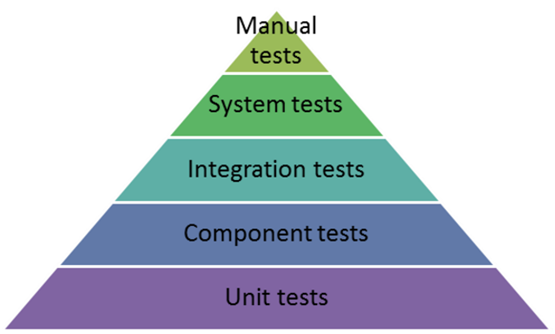

# K4

## Aufgabe 1

- Frontend: Karma, Cypress (e2e)
- Backend: Unit, Component Tests (JUnit)
- Unit Tests, Component Tests
- Nach jedem Commit läuft eine Pipeline, in der die alle tests laufen (microservice), nach dem mergen auf dev läuft noch eine test pipeline. Danach wird vom QA Mitarbeiter die im Ticket angegebenen testcases durchgetestet. Vor dem Release wird dann nochmals die funktionalität der neuen und alten komponenten getestet
- Ja, ein QA Mitarbeiter
1.  Requirements analasys
2.  Feature Development
3.  Unit Test / E2E Test / Integration Test
4.  Test execution (pipelines)
5.  QA Manual testing anhand der requirements (System testing)

## Aufgabe 2

#### Proaktives Testing

Das Testing wird so früh wie möglich im design implementiert (TDD) um Fehler zu erkennen bevor sie implementiert werden

#### Reaktives Testing

Erst nach dem design und der implementierung erfolgt das testing

#### Hybride

Es gibt wie so üblich auch Hybride Methoden, welche nach anderen Industrie Standarda entsprechen.

#### Testing Levels

Manual Tests / Acceptance tests werden von den Stakeholdern getestet

#### Testing Types

###### Accessibility Testing 
Testet ob die App/Platform etc. auch für Benutzer mit Einschränkungen nutzbar ist. (Farbenblindheit, Sehschwäche etc.)

###### Acceptance Testing 
Beim Acceptance testign geht es darum, ob die software den Business requirements entspricht und der Endnutzer die Platform wie gewollt benutzen kann. 

###### Black Box Testing 
Während des Testings ist der Code nicht "sichtbar".

###### End to End Testing 
Beim E2E testing wird ein Abreitsflow getestet. Dies soll testen wie der Benutzer mit der Platform interagiert, und ob die Platform das gewünschte macht.

###### Interactive Testing 
Auch Manual Testing genannt. Dabei geht es weniger um ein system welches testet, sondern mehr um eine Person, welche die Software durchtestet

###### Integration Testing 
Das Integration testing testet die Funktionalität eines Features und dessen Integration in das System.

###### Load Testing 
Testet wie die Platform auf stress reagiert. Das heisst was passiert bei mehreren Anfragen, wie gross wird die Latenz, gibt es Probleme / Ausfälle?

###### Security Testing 
Dabei wird die Sicherheit der Software auf die Probe gestellt. Es werden versucht Sicherheitslücken im Syste, zu finden und diese danach zu fixen. Es kann vorkommen das Firmen extra Leute beauftragen, welche diese Testst durchführen.

###### Stress Testing 
Testet die Platform wie sie auf übernormale activity reagiert (botnet angriffe)

###### Unit Testing 
Testet kleine teile des codes.
